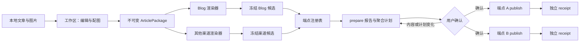

# 多端文章发布架构

本文描述 `publish-article` 的稳定架构边界。系统的目标不是把 Markdown 分别复制到几个平台，而是先固定“发什么”，再固定“每个渠道实际发送哪些字节”，最后让用户只授权已经审阅过的发布计划。

核心不变量可以概括为：

> `ArticlePackage` 固定内容，`renderDigest` 固定渠道候选，`planDigest` 固定发布意图，确认令牌固定授权范围，receipt 固定已经发生的事实。

## 为什么需要分层

文章创作、渠道排版和远端发布具有不同的不确定性：

- 编辑和配图可能反复变化，属于创作过程。
- Blog 与内容平台需要不同的目录、HTML 和图片格式，属于渠道渲染。
- Git、草稿 API 等远端系统有不同的失败与恢复语义，属于发布执行。

如果把它们压进一个脚本，用户看到的预览可能不是最终发送的字节；一个端点失败后，也很难判断另一个端点是否已经产生副作用。五层模型把这些边界显式化。

## 五层模型

| 层 | 主要对象 | 负责什么 | 不负责什么 |
| --- | --- | --- | --- |
| 1. 来源与工作区 | 原始 Markdown、源图片、`draft/`、`working/` | 导入指定文章、轻量编辑、配图和保留创作中间产物 | 不直接修改远端，不把源目录当发布目录 |
| 2. 不可变文章包 | `ArticlePackage` | 固定正文、发布 metadata、素材清单及其内容摘要 | 不包含渠道样式、绝对路径、凭证或运行时间 |
| 3. 渠道渲染与冻结 | Blog bundle、冻结 HTML、派生图片、render manifest | 把同一文章包转换成可审阅的渠道候选，并固定最终字节 | 不在 publish 时重新排版或重新生成图片 |
| 4. 发布计划与确认门 | `PreparedPublication`、聚合计划、准备报告 | 固定目标、选项、基线、候选摘要和副作用动作 | 不执行被标记为有副作用的动作 |
| 5. 端点执行与回执 | `PublisherEndpoint`、`PublishReceipt`、checkpoint | 校验确认、执行副作用、记录结果并提供安全的状态观察 | 不假装所有端点是一个可回滚的全局事务 |



## 第一层：来源与工作区

导入器只处理用户明确指定的一篇文章，不扫描整个笔记库。源 Markdown 和源图片保持只读，所有可变工作都进入仓库忽略的运行目录：

```text
<working-run>/
├── imported.json
├── state.json
├── draft/
│   ├── body.md
│   ├── metadata.json
│   └── assets/
└── working/
```

本地图片会被复制并按内容计算摘要，正文引用被改写为稳定的 `asset://<asset-id>`。远程图片、缺失图片、歧义路径和越界符号链接必须在进入文章包前处理。

## 第二层：不可变 ArticlePackage

`ArticlePackage` 是所有发布端点共享的渠道无关事实源。真实接口定义见 [`types.ts`](../.agents/skills/publish-article/scripts/src/types.ts)：

```ts
interface ArticlePackage {
  schemaVersion: 1;
  articleId: string;
  revision: string;
  metadata: ArticleMetadata;
  body: { path: "body.md"; sha256: string };
  assets: ArticleAsset[];
  provenance: {
    sourceId: string;
    sourceDigest: string;
    packagerVersion: 1;
  };
}
```

其中：

- `articleId` 是文章的稳定身份，改标题或更新正文时仍可保持不变。
- `revision` 是本次文章版本的身份，由 canonical metadata、正文摘要和排序后的素材摘要共同计算。
- `sourceDigest` 证明导入时读取的是哪一份原始输入，但不参与渠道发布定位。
- 包内只使用相对路径；绝对路径、mtime、预览文件、凭证和回执不进入 revision。

只要正文、发布 metadata 或任一素材字节变化，就会得到新的 revision。反过来，相同 revision 表示所有端点消费的是同一份文章内容，而不表示各渠道最终字节相同。

## 第三层：渠道渲染与冻结

每个渠道可以有独立 renderer：

- Blog renderer 生成固定目录结构和文章 bundle。
- HTML 渠道 renderer 生成带内联样式的正文片段和兼容图片。
- 新渠道可以生成 JSON、纯文本、视频描述文件或其他格式。

创作型渲染可能使用模型或外部工具，因此首次输出不应被视为确定性的。用户审阅后，系统冻结候选并计算 `renderDigest`。publish 阶段只能读取并复核这份候选，不能重新渲染。

一个合格的冻结目录至少应提供：

- 归属的 `articleId` 与 `articleRevision`；
- 最终 payload 及其字节摘要；
- 所有派生素材的路径、大小、媒体类型和摘要；
- renderer、主题和工具链版本或来源；
- 整个候选的 `renderDigest`；
- 可供用户审阅的 preview 或 diff。

## 第四层：发布计划与确认门

端点的 `prepare()` 返回 `PreparedPublication`：

```ts
interface PreparedPublication {
  schemaVersion: 1;
  endpoint: string;
  articleId: string;
  packageRevision: string;
  optionsDigest: string;
  planDigest: string;
  artifactRoot: string;
  actions: PublishAction[];
  baselineDigest?: string;
  renderDigest?: string;
  previewPath?: string;
}
```

`artifactRoot` 和 `previewPath` 用于本机执行与展示，不直接进入确认意图。确认绑定的是内容身份、候选摘要、选项摘要、目标基线和动作列表，因此同一计划可以在本机路径变化之外保持清晰的安全边界。

`prepare` 的职责是：

1. 运行只读 preflight；
2. 复核候选与 ArticlePackage 的归属关系；
3. 读取并摘要化端点配置、目标身份和工具链身份；
4. 获取可安全观察的当前基线；
5. 列出确认后会执行的每个动作及其副作用属性；
6. 返回确定性的端点计划。

端点自身的 `preflight` 和 `prepare` 不得修改目标工作树或远端服务。CLI 可以在运行目录中保存计划与报告，这属于本地审阅产物，不是发布副作用。

多个端点计划会按目标 ID 排序后组成聚合计划。聚合确认一次绑定所有被选中的 endpoint plan；任一端点的 revision、render、options、baseline 或 actions 变化，都必须重新 prepare 和确认。

## 摘要之间的关系

| 摘要 | 回答的问题 | 典型输入 |
| --- | --- | --- |
| `sourceDigest` | 导入的是哪份原始文件 | 原始 Markdown 字节 |
| `revision` / `packageRevision` | 发布内容是否变化 | metadata、正文摘要、素材摘要 |
| `renderDigest` | 渠道最终候选字节是否变化 | 冻结目录、HTML、bundle、派生素材 |
| `optionsDigest` | 端点配置和提供方身份是否变化 | 目标、账号别名、工具版本、发布选项 |
| `baselineDigest` | 可变目标在确认后是否变化 | Git HEAD、远端 ref、目标目录或其他基线 |
| `planDigest` | 整个端点意图是否变化 | 上述摘要、动作列表和端点扩展字段 |
| `idempotencyKey` | 是否在执行同一个已确认计划 | endpoint、revision、options、plan、baseline、render |

确认令牌由规范化后的确认意图计算，确认意图包含：

```text
schemaVersion
endpoint
articleId
packageRevision
optionsDigest
planDigest
baselineDigest
renderDigest
actions
```

确认令牌不是远端凭证，也不应写入公开日志。它只证明用户授权了某一份具体计划。

## 第五层：端点执行与回执

所有发布端点实现同一生命周期：

```ts
interface PublisherEndpoint {
  readonly id: string;
  readonly capabilities: EndpointCapabilities;
  preflight(article: ArticlePackage, context: EndpointContext): Promise<Record<string, unknown>>;
  prepare(article: ArticlePackage, context: EndpointContext): Promise<PreparedPublication>;
  publish(prepared: PreparedPublication, confirmation: string, context: EndpointContext): Promise<PublishReceipt>;
  status(receipt: PublishReceipt, context: EndpointContext): Promise<Record<string, unknown>>;
}
```

publish 必须在第一个副作用之前完成以下复核：

- 确认令牌仍匹配 prepared plan；
- ArticlePackage revision 没有变化；
- endpoint options 和目标身份没有变化；
- renderDigest 与冻结候选一致；
- baselineDigest 仍与目标现状一致；
- 已有 receipt 或 journal 不表示相同副作用已经完成或结果未知。

每个端点独立生成 `PublishReceipt`：

```ts
interface PublishReceipt {
  schemaVersion: 1;
  receiptId: string;
  endpoint: string;
  articleId: string;
  packageRevision: string;
  planDigest: string;
  idempotencyKey: string;
  state: ReceiptState;
  checkpoint?: string;
  sideEffects: Array<Record<string, unknown>>;
  statusLocator?: Record<string, unknown>;
  error?: PublishErrorData;
}
```

回执描述事实而不是愿望：已经产生的 commit、远端更新、草稿或其他资源必须记录在 `sideEffects`；尚未发生的动作不能写成成功。

### Receipt 状态

| 状态 | 含义 |
| --- | --- |
| `prepared` | 发布已经开始，但还未完成可证明的最终动作 |
| `committed` | 本地提交等可恢复 checkpoint 已完成，后续远端动作尚未完成 |
| `pushed` | Git 类端点已经验证目标远端 ref |
| `draft_created` | 草稿类端点已经严格证明草稿创建成功 |
| `failed` | 可以证明目标动作未完成 |
| `partial` | 已产生部分副作用，需要 checkpoint 恢复或人工清理 |
| `outcome_unknown` | 无法证明成功或失败，必须先检查远端，禁止盲目重试 |

整个批次不是一个全局事务。端点 A 成功而端点 B 失败时，系统返回两份独立 receipt；它不会假装能撤销已经发生的远端副作用。

## 错误原因与远端结果必须分开

`PublishErrorData.kind` 解释“为什么失败”，`outcome` 解释“目标端发生了什么”：

```ts
type PublishErrorKind =
  | "validation"
  | "precondition"
  | "conflict"
  | "auth"
  | "rate_limit"
  | "transient"
  | "provider_rejected"
  | "outcome_unknown";

type PublishOutcome = "not_applied" | "applied" | "partial" | "unknown";
```

- `not_applied`：可以证明没有目标副作用；修复条件后可重新准备或由用户重试。
- `applied`：动作已经完整发生，应直接保存成功回执。
- `partial`：部分动作已发生，必须沿 checkpoint 恢复或人工处理。
- `unknown`：结果不可判定，必须先查询或人工检查远端。

自动重试只有在 `retryable=true` 且 `outcome=not_applied` 时才成立。超时、连接中断或提供方响应无法解析时，不能因为“看起来像失败”就再次创建资源。

## Registry 与当前端点

[`PublisherRegistry`](../.agents/skills/publish-article/scripts/src/registry.ts) 保存 endpoint factory，并保证：

- ID 非空且不能重复注册；
- factory 创建的新实例必须返回同一个 `endpoint.id`；
- 未注册 ID 立即失败，不做隐式 fallback。

当前实现包含两个不同恢复语义的端点：

- `blog-git`：支持 publish、update 和 status，可绑定 Git 基线并验证远端 ref。
- `wechat-draft-baoyu`：只支持创建私有草稿，不支持正式发布，也没有安全的远端草稿状态查询契约。

能力声明用于展示和前置判断，但不能替代方法内部的安全校验。

## 安全边界

- 凭证只从受控环境或被忽略的私有配置读取，不进入 ArticlePackage、计划、报告或 receipt。
- 报告只展示非敏感目标别名，不展示凭证、确认令牌或提供方资源原始标识。
- 冻结目录与运行目录应被版本控制忽略；正式文章 bundle 是否进入 Git 由具体端点决定。
- 所有路径必须限定在声明的根目录内，并拒绝逃逸路径和不受信任符号链接。
- 外部工具链必须绑定版本或文件摘要；工具链变化会使旧确认失效。
- status 只能报告能够安全验证的事实。没有可靠查询契约时返回 `supported: false`。
- 草稿与公开发布是两个能力；草稿端点不得偷偷升级为公开发布。

## 代码入口

- 数据接口：[`types.ts`](../.agents/skills/publish-article/scripts/src/types.ts)
- 端点注册：[`registry.ts`](../.agents/skills/publish-article/scripts/src/registry.ts)
- 聚合计划与报告：[`prepare-report.ts`](../.agents/skills/publish-article/scripts/src/prepare-report.ts)
- 确认与幂等：[`receipts.ts`](../.agents/skills/publish-article/scripts/src/receipts.ts)
- 错误模型：[`errors.ts`](../.agents/skills/publish-article/scripts/src/errors.ts)
- CLI 编排：[`cli.ts`](../.agents/skills/publish-article/scripts/src/cli.ts)
- Blog 端点：[`blog-git.ts`](../.agents/skills/publish-article/scripts/src/endpoints/blog-git.ts)
- 草稿端点：[`wechat-draft.ts`](../.agents/skills/publish-article/scripts/src/endpoints/wechat-draft.ts)
