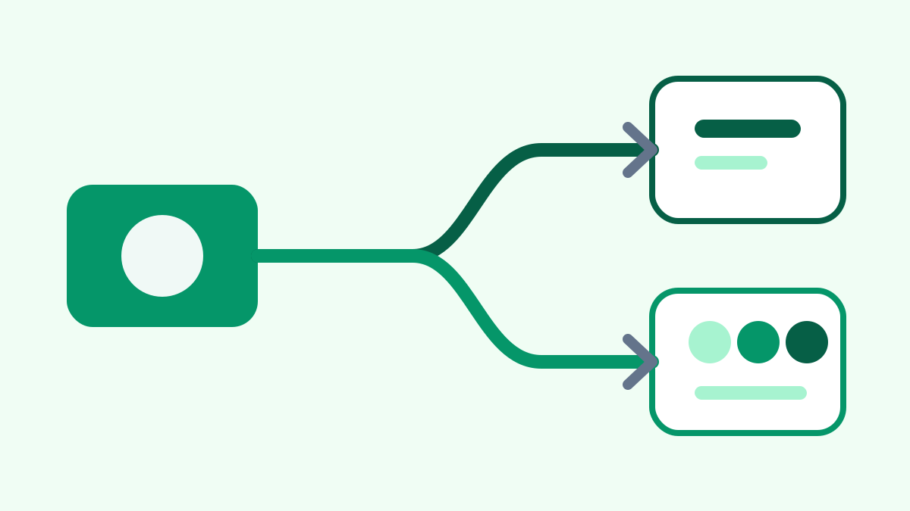

One source article can become multiple channel candidates without changing the original file. The publisher first creates a channel-neutral package containing normalized metadata, body content, and local assets.

Each channel renders its own reviewed candidate from that package. The Blog receives a Hugo leaf bundle, while WeChat receives frozen HTML and API-compatible image derivatives.

No remote side effect occurs until the preparation report, diff, preview, and exact action list have been confirmed. Independent receipts then record what happened at each endpoint.

